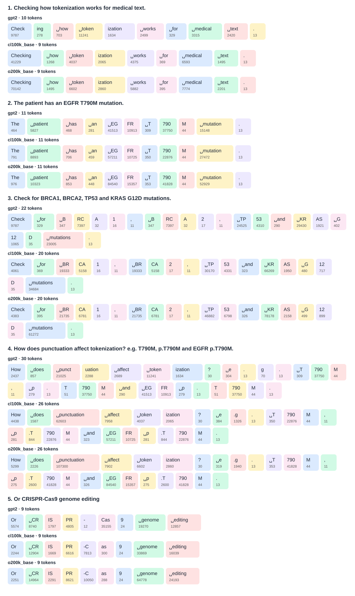

## Tokenization Experiments

These experiments follow the tokenization material in Raschka, Chapter 2, and examine how general-purpose language-model tokenizers represent biomedical terminology.

How are gene symbols, protein mutation identifiers, punctuation, and scientific terms split into tokens by different generations of byte-pair encoding (BPE) tokenizers?

The notebook [`01_tokenization_experiments.ipynb`](01_tokenization_experiments.ipynb) uses `tiktoken` to compare:

- `gpt2`: approximately 50K tokens
- `cl100k_base`: approximately 100K tokens, used by GPT-3.5/GPT-4-era models
- `o200k_base`: approximately 200K tokens, used by later models

The test phrases include:

- General medical text
- Gene symbols such as `EGFR`, `BRCA1`, `BRCA2`, `TP53`, and `KRAS`
- Mutation identifiers such as `T790M`, `p.T790M`, and `G12D`
- Punctuation-heavy biomedical text
- `CRISPR-Cas9 genome editing`

For each tokenizer and phrase, I print the token count and render it as an HTML visualization. Each colored token box shows the decoded token and its integer token ID; spaces and newlines are displayed as `␣` and `↵` to make invisible characters explicit.

### Generated visualization

The comparison makes it possible to inspect how vocabulary size and tokenizer generation affect biomedical text efficiency. Gene symbols and mutation notation may be represented as several subword tokens rather than as single semantic units, and small changes in punctuation or formatting can change the resulting tokenization. Token counts from this notebook can be used as a quick diagnostic when estimating context usage for biomedical prompts or datasets.